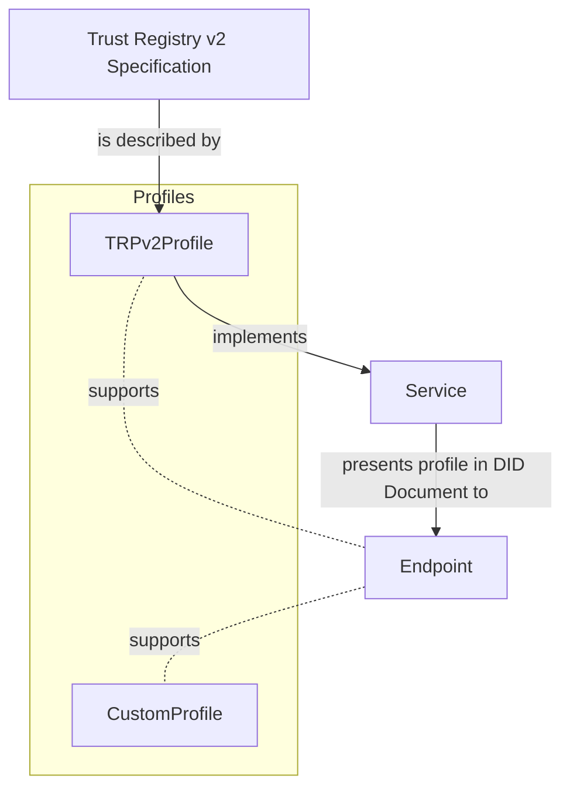
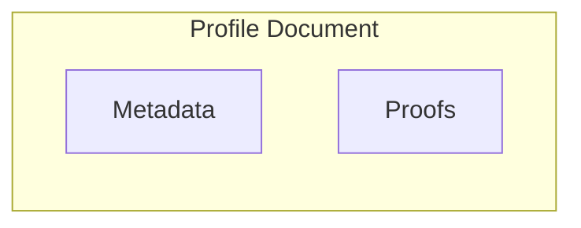

## ToIP Service Profile Specification

**Status:** Pre-Draft 0.0.1  
**Latest Draft**:   
**Previous Draft:**  
**History:** [Commit History](https://github.com/trustoverip/tswg-trust-registry-service-profile)  
**Task Force:** Trust Registry Task Force  
**Organization:** Trust Over IP  
**Editors**  Andor Kesselman, Sam Curren  
**Chairs:** Andor Kesselman, Darrell o' Donnell, Antti Kettunen  
**Contributors:** Darrel o' Donnell, Antti Kettunen, Sankarshan Mukhopadhyay, Dan Bachenheimer, Mathieu Glaude, Drummund Reed, Alex Tweeddale, Tim Bouma  
**Feedback:** [Github Issues](https://github.com/trustoverip/tswg-trust-registry-service-profile/issues)  
**Related Documents:** [Trust Registry Protocol](https://github.com/darrellodonnell/tswg-trust-registry-tf/tree/main/v2)  

**Status Description**: This document is a preliminary draft and should not be regarded as a finalized version. It is subject to ongoing revisions and modifications, and its content may change significantly before reaching a final form. Please note that the information presented herein is not binding and is provided for reference and discussion purposes only. Your feedback and input are essential in shaping the final version of this document. We intend to add additional supporting material before the specification is finalized. 

### Introduction

This specification outlines the structure and requirements for enabling
additional service discovery through profile definitions within a Decentralized
Identifier (DID) document. By integrating service endpoints and profile
information, this approach enhances the capabilities of DIDs for decentralized
and self-sovereign identity systems. Some of the possible advantages include: 

- service and profile crawlers become possible, enabling better service
discovery and interoperability across services. 
- better descriptive power for individual services composibility of capabilities for succinct representation of capabilities.

### Objective

The purpose of this specification is to enhance the ability for an endpoint
system and user to discover capabilities of a service within a decentralized
context. Developed within the Trust Registry Task Force at Trust Over IP, this
spec offers a straightforward yet effective discovery layer for both legacy and
new trust registry services. The intended audience includes individuals or
entities seeking to improve service interoperability with their existing services or on new services.

### Example

In this example, we illustrate a practical example of profiles. We have a Service that
complies with the Trust Registry Protocol v2 specification developed by Trust Over IP. 
This Service exposes an endpoint capable of accommodating multiple profiles. 
When sharing the Service's DID Document, we also share a Profile object with the endpoint, 
indicating its support for the Trust Registry Protocol v2 Profile. The client now knows what the service 
endpoint described supports, and how to interact with that service.



### Service Endpoint Profile Specification

The data structure outlined in this specification is designed to establish a
consistent approach for integrating service endpoint profiles within a DID
document. Adherence to the subsequent guidelines is mandatory:

- It is imperative that this structure takes the form of a singular struct.
- The ensuing properties are obligatory:
  - `uri`: A URI attribute delineating the interaction's endpoint address.
  - A choice between the ensuing options:
    - `profile`: A JSON Profile document that can be resolved through HTTPS. Further requisites are detailed in the "Profile Document" section.
    - `definition`: If provided, this signifies the resolvable URI attribute
      enmeshed within the DID document. The corresponding definition is required to comply with the specifications delineated in the subsequent profile document section.
    - An `integrity` property MAY be added as an aid in integrity protection and verification of the Profile document. It MUST be in the format of a  MultiHash, `<hash-func-type><digest-length><digest-value>` encoded as a varint and defined here [Multiformat](https://multiformats.io/multihash/). 

An array of structs is not valid.

**Example**

This following is an portion from the DID Document. 

```json
{
  "@context":[
      "https://www.w3.org/ns/did/v1",
      "https://trustoverip.org/profile/v2"
  ],
  ...
  "service": [{
    "id": "did:example:123#trust-registry",
    "type": "TrustRegistry", 
    "serviceEndpoint": {
        "profile": "https://trustoverip.org/profiles/trp/v2",
        "uri": "https://my-tr-service/",
        "integrity: "122041dd7b6443542e75701aa98a0c235951a28a0d851b11564d20022ab11d2589a8",
    }
  }]
}
```

#### JSON Schema for Service Endpoint Struct

```json
{
  "$schema": "http://json-schema.org/draft-07/schema#",
  "type": "object",
  "properties": {
    "uri": {
      "type": "string",
      "format": "uri"
    },
    "profile": {
      "type": "string",
      "format": "uri"
    },
    "definition": {
      "type": "string",
      "format": "uri"
    }
  },
  "required": ["uri"],
  "anyOf": [
    { "required": ["profile"], "not": { "required": ["definition"] } },
    { "required": ["definition"], "not": { "required": ["profile"] } }
  ],
  "additionalProperties": false
}
```
    
### Profile Document Specification

#### Profile Data Model

The profile data model is heavily inspired by the VC Data Model.

In this section, we delve into the intricacies of the profile data payload
structure, designed to encapsulate essential information within a decentralized
context. The structured data adheres to a comprehensive schema, ensuring
consistency and coherence in the representation of profiles associated with
Decentralized Identifiers (DIDs). By adhering to this structure, service
endpoint profiles can integrate with DID documents, fostering
enhanced service discovery and interaction.

The profile data payload is composed of three primary components, each serving a distinct purpose:

**Metadata:** This segment provides overarching details about the profile, offering
insight into its origins, content, and context. Key attributes encompass the
decentralized identifier (DID), profile type, creation timestamp, media type,
version, and descriptive elements that collectively contribute to the profile's
identity and purpose.

**Proof:** This component encapsulates information related to the authentication and integrity verification of the profile data. Various properties, including the proof type, creation timestamp, proof value, and verification method, work in
concert to substantiate the authenticity of the profile's content and source.

Throughout this section, we dissect the schema-driven structure of the profile
data payload, elucidating its constituent elements and their roles in enabling
robust, secure, and standardized profile integration within the realm of
Decentralized Identifiers. By comprehending the nuances of this payload format,
stakeholders can harness the power of interoperable profiles to facilitate
seamless interactions and enriched service discovery experiences.

**Profile Document Data Model**



#### Profile Data Model Specification 

A profile data model is a document with the following properties:

* The document **MUST** have a `metadata` object with the following properties:
    * The `id` property **MUST** be present and **MUST** be a DID. 
    * The document **MUST** have a `type` property and the the value of the `type` property **MUST** be, or map to (through interpretation of the @context property), one or more URIs. If more than one URI is provided, the URIs MUST be interpreted as an unordered set. It is RECOMMENDED that each URI in the type be one which, if dereferenced, results in a document containing machine-readable information about the type.
    * The document **MUST** contain a `profileType` property. If present, is a string indicating the specific type or category of the profile. This property can help categorize and classify the profile data further.
    * The document MAY contain a `created` property, which is an ISO-8601 timestamp indicating the date and time when the profile data was created or initially recorded.
    * The document MAY contain a `name` property, if provided, is a human-readable name assigned to the profile. It offers a recognizable label for the profile data.
    * The document MAY contain a `description` property. if given, offers a detailed textual description of the profile. This description can provide insights into the purpose, content, and usage of the profile data.
    * The document MAY contain a `short_description` property. If available, provides a succinct summary or brief overview of the profile. This summary can be useful for quick references.
    * The document MAY contain a `docs_url` property, if supplied, is a URL pointing to documentation related to the profile data. This URL can lead to additional resources or information about the profile.
    * The document MAY contain a `version` property. If given, holds a string indicating the version of the profile data. This version should follow the semantic versioning (semver) format for version numbering.
    * The document MAY contain a `tags` property. If present, is an array of strings that serve as tags associated with the profile data. These tags can aid in searchability and categorization of the profile. This is useful for indexers. 
    * The document MAY contain a `transport` property. If present, it is an array of strings to specify the available transports to interact with the service.

#### JSON Schema

The Profile Document provides a comprehensive framework for capturing profile-related information within the DID document.

```json
{
  "$schema": "http://json-schema.org/draft-07/schema#",
  "type": "object",
  "properties": {
    "metadata": {
      "type": "object",
      "properties": {
        "id": {
          "type": "string",
          "description": "The decentralized identifier representing the profile in the DID format."
        },
        "type": {
          "type": "string",
          "description": "A string indicating the type of the profile."
        },
        "checksum": {
          "type": "string",
          "description": "A checksum value for data integrity validation."
        },
        "created": {
          "type": "string",
          "description": "Timestamp indicating profile creation date."
        },
        "name": {
          "type": "string",
          "description": "A human-readable name for the profile."
        },
        "previous": {
          "type": "string",
          "description": "Reference to a previous version of the profile data."
        },
        "description": {
          "type": "string",
          "description": "A detailed description of the profile."
        },
        "short_description": {
          "type": "string",
          "description": "A concise description of the profile."
        },
        "docs_url": {
          "type": "string",
          "format": "uri",
          "description": "URL to documentation for the profile data."
        },
        "version": {
          "type": "string",
          "description": "The version of the profile data, following semver."
        },
        "tags": {
          "type": "array",
          "items": { "type": "string" },
          "description": "Tags associated with the profile data."
        },
        "transports": {
          "type": "array",
          "items": { "type": "string" },
          "description": "Transports associated with service."
        }

      },
      "required": [
        "id"
      ],
      "additionalProperties": true
    },
    "definitions": {
      "type": "object",
      "description": "Defines capabilities or services related to the profile data."
    },
    "proof": {
      "type": "object",
      "description": "Information related to proofing the authenticity of the profile data."
      // Additional properties related to proofing can be added here.
    }
  },
  "required": ["metadata"],
  "additionalProperties": false
}
```

#### Profile Document Sample 

The following describes a sample profile document.

```json
{
  "metadata": {
    "id": "did:example:123456",
    "profileType": "TrustRegistry",
    "created": "2023-08-18T12:34:56Z",
    "description": "An RestfulAPI that describes how an ecosystem based on trust can query and interact with a service to perform a query agasint a trusted regsitry.",
    "transport": []
    "short_description": "The open standard trust task protocol defined by the ToIP Foundation to perform the trust task of querying a trust registry.",
    "docs_url": "https://trustoverip.org/trustregistryprotocol",
    "version": "2.0.0",
    "tags": ["toip", "trustregistryprotocol"]
  },
  "proof": {
    "type": "Ed25519Signature",
    "created": "2023-08-18T12:34:56Z",
    "proofValue": "abcdefg123456",
    "verificationMethod": "did:example:123456#key1"
  }
}
```
### Security Considerations

This section describe a non-normative, non-exhaustive list of security considerations. 

#### Cryptography Suites and Libraries
_This section is non-normative._

Some aspects of the profile model described in this specification can be protected through the use of cryptography. It is important for implementers to understand the cryptography suites and libraries used to create and process credentials and presentations. Implementing and auditing cryptography systems generally requires substantial experience. Effective red teaming can also help remove bias from security reviews.

#### Unsigned Profile Documents

_This section is non-normative._

This specification allows profiles to be produced that do not contain signatures or proofs of any kind. These types of profiles are often useful for cases where users may not have the ability to take advantage of the cryptographic proof mechanisms. Endpoint systems should be aware that these types of profiles are not verifiable because the authorship either is not known or cannot be trusted.

### Future Work

**Service Descriptors and Capability Declarations** We intentionally excluded a
feature from this specification that we are eager to explore in future versions.
This pertains to defining the capabilities or services associated with the
profile data. By outlining the functions embodied by the profile, this section
provides clarity on the profile's purpose and its role within the DID ecosystem.

### References and Acknowledgements 

- Initial Proposal: https://github.com/trustoverip/tswg-trust-registry-tf/discussions/96
- DID Linked Resources :
  https://docs.google.com/presentation/u/0/?usp=slides_web : useful for
  understanding metadata.
- DID Core: https://www.w3.org/TR/did-core/ - Referenced mainly the DID Core spec.
- DIDComm Messaging:  https://identity.foundation/didcomm-messaging/spec/ - used
  for understanding how to update the service endpoint of the DID Document.
- [MultiHash](https://multiformats.io/multihash/): Used for integrity field.
- https://www.w3.org/TR/vc-data-model/ : For the securtiy considerations and guidance on the profile document structure. 
